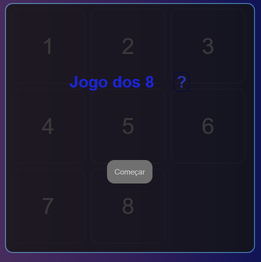
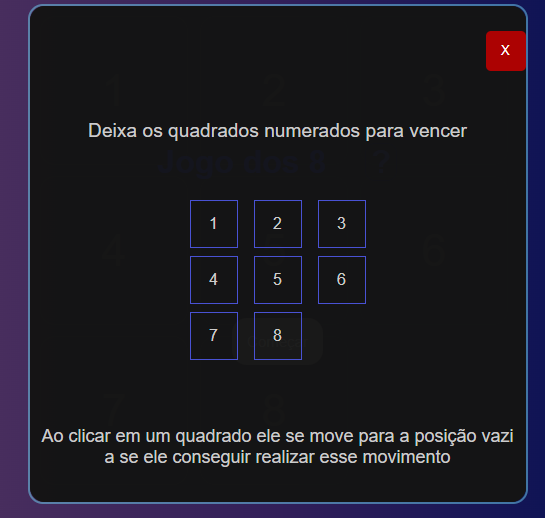
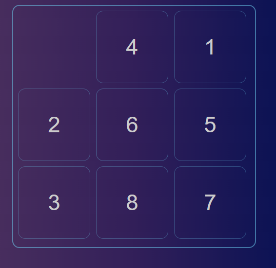
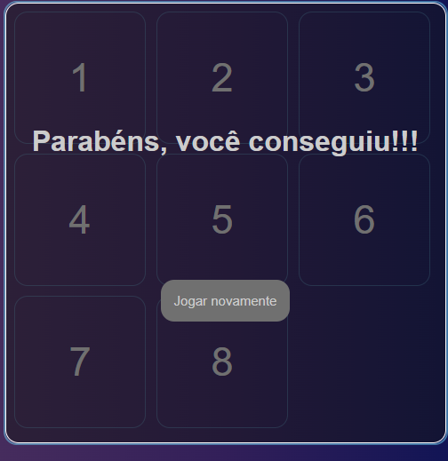

# Jogo dos 8
# Sobre o projeto

<a href="8game.netlify.app">8game.netlify.app</a>

Projeto feito para testar minha lógica utilizando JS puro.

Consiste em um mini-game em que quadrados numerados e embaralhados devem ser colocados em ordem(de 1 a 8) para concluir o desafio.

## Imagens do projeto

    
    
    
    

# Tecnologias utilizadas
- HTML
- CSS
- JS

## Implantação
- Projeto implementado no Netlify

# Autor

Diego Cruz's

<a href="https://www.linkedin.com/in/diego-cruz-56436b248/">https://www.linkedin.com/in/diego-cruz-56436b248/</a>